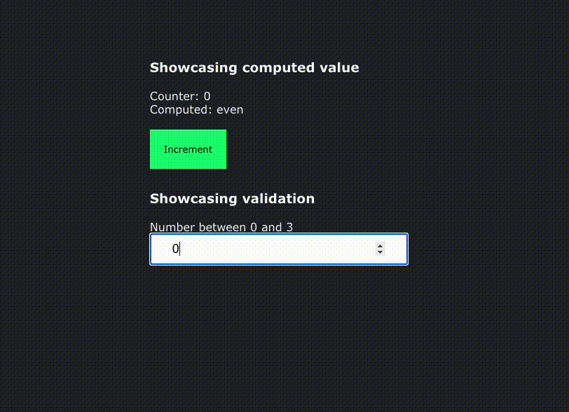

# React signals form

This is a proof-of-concept showing how to use the proposed Signals API with a React form.

## What are Signals?

See:

https://eisenbergeffect.medium.com/a-tc39-proposal-for-signals-f0bedd37a335

https://github.com/tc39/proposal-signals

https://github.com/proposal-signals/signal-polyfill

In a nutshell they are a way to compose acyclic graphs that are a performant way to create a reactive data structure.

## What does this project show?

It shows that it's quite trivial to use Signals with React.

## What issues does this implementation have?

It is of course very naive. It would take a significant effort to actually create a form library that handles dependencies and computed values (including all the other features a full fledged form library ought to have) and only validates the values that are dirty. The data model I just threw together as with the validation etc. Type safety is lacking obviously.

However it's enough of a POC at least for me to see that this approach is worth pursuing further.
